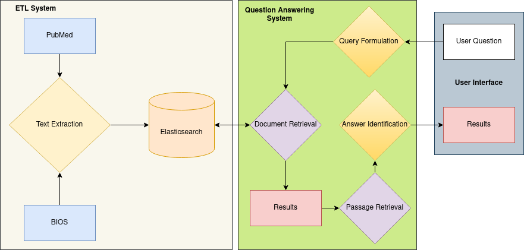

# Information Retrieval-Based Biomedical Question Answering System

This Master's project is part of the module **Web-interface for Langugage Processing Systems** in M.Sc. Intelligent Adaptive Systems. We build a biomedical question answering system that is composed of the following components:

* An **Text Extractor** that extracts full body text from PubMed text dump
* A **Query Formulation** module composed of BioMedical Named Entity Recognition model to extract keywords from the user's natural language questions
* An **Information Retrieval** module built using Elasticsearch to retrieve relevant passages from the PubMed text
* A **Question Answering** model that uses BioBert fine-tuned on SQuAD dataset to retrieve answers from the passages

## System Architecture

## Running the system

1. Install Docker
2. Run the following command

* For first time, 
    
    `docker-compse up --build`
* For other times, 
    
    `docker-compse up`

3. Load the data by running

    `docker exec -it *container_id* python3 retriever/load.py`

    *Note: the `container_id` can be found by running `docker container ls`. It's the one with name `biomedqa-web`*

    *Note: the data should be in the retriever folder named `data.json`*

4. Use `Ctrl+C` to shutdown, then

    `docker-compose down`