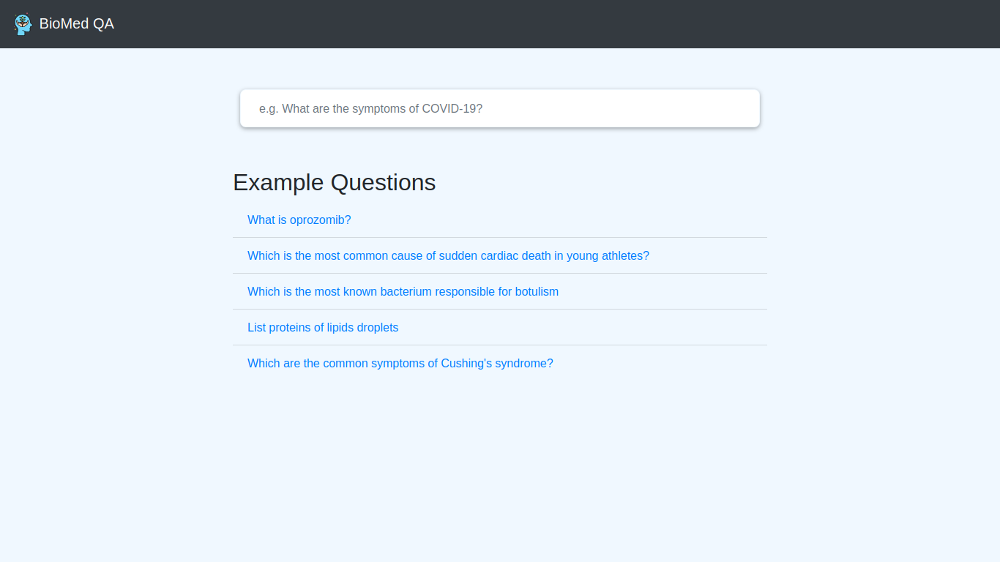

# Information Retrieval-Based Biomedical Question Answering System

This Master's project is part of the module **Web-interface for Langugage Processing Systems** in M.Sc. Intelligent Adaptive Systems. We build a biomedical question answering system that is composed of the following components:

* An **Text Extractor** that extracts passages from the XML file of a research article. The XML data dump is taken from [PubMed Open Access Non-Commercial Data Dump](https://ftp.ncbi.nlm.nih.gov/pub/pmc/oa_bulk/oa_comm/xml/)
    
* A **Query Formulation** module composed of BioMedical Named Entity Recognition model to extract keywords from the user's natural language questions

* An **Passage Retrieval** module to retrieve relevant passages from the PubMed text in two stage process
    1. Retrieve top 100 passages using BM25 with Fuzzy search
    2. Re-rank the passages based on cosine similarity scores between question embedding and passage embeddings. The embeddings were created using MiniLM model. [1] The top 50 passages are selected. 

* A **Question Answering** model that uses PubMedBert fine-tuned on SQuAD v.2 dataset [2] to retrieve answers from the passages

## Documentation

- [Report](https://github.com/awalesushil/biomed-qa/blob/main/report.pdf)
- [Slides](https://github.com/awalesushil/biomed-qa/blob/main/slides.pdf)

## System Architecture


## Running the system

**Prerequisite**: Docker installed

1. Run the following command
    
    `docker-compse up --build`

The system can be accessed at [http://0.0.0.0:8000](http://0.0.0.0:8000). The following is the screenshot of the landing page.



2. Use `Ctrl+C` to shutdown, then

    `docker-compose down`

## Loading data

**Prerequisite**: Download the PubMed XML data dumps from the above link

The `loader_script.py` needs to run from outside the docker container since the data is not copied into docker context.

1. Create a Python environment and install all dependencies.

    `python3 -m venv .env`

    `source .env/bin/activate`

    `pip3 install -r requirements.txt`

2. Load the data by running `loader_script.py`. This file can be modified to load the data into **HNSWLib Index** as well.

    `python3 app/loader_script.py`

## Question Answering

The user can now directly type in a medical question in natural language on the search input section. The system will display upto five passages with answers to the question highlighted in a separate section. 


## Evaluation

The quality of the question answering system can also be evaluated by pressing the `Evaluate` button for each query individually. The user is provided with the option to mark each answer as `Relevant` or `Not-relevant`. The responses are stored in the system as JSON files.


## References

```
[1] N. Reimers and I. Gurevych, “Sentence-bert: Sentence embeddings using siamese bert-networks,” in Proceedings of the
2019 Conference on Empirical Methods in Natural Language Processing, Association for Computational Linguistics, 11
2019.
```
```
[2] Y. Gu, R. Tinn, H. Cheng, M. Lucas, N. Usuyama, X. Liu, T. Naumann, J. Gao, and H. Poon, “Domain-specific language
model pretraining for biomedical natural language processing,” ACM Transactions on Computing for Healthcare (HEALTH),
vol. 3, no. 1, pp. 1–23, 2021.
```
